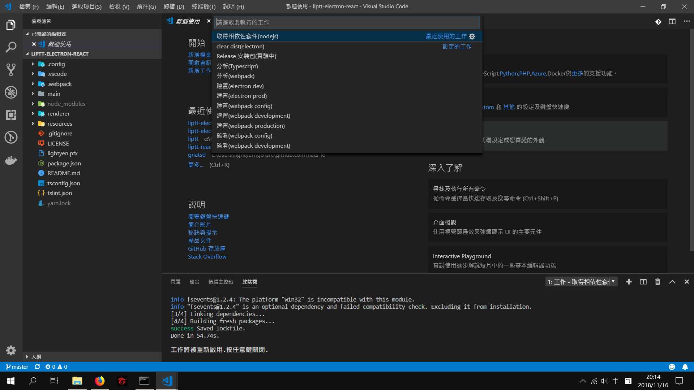

# vscode 的 Task

由於在編譯程式的時候每次都要打相同的指令有點枯燥乏味  
所以我寫了一些常用的 task 以便方便使用。  

  

- `取得相依性套件(nodejs)` 給第一次還沒有下載node_modules時使用的
- `建置(electron)` 是用來編譯electron的後端程式碼。
- `建置(webpack)` 是用來編譯electron的前端程式碼。
- `建置(webpack config)` 是來編譯webpack設定檔的，因為我的設定檔也是用typescript寫成，所以需要先編譯這個才能編譯前端。
- `監看(webpack)` 是開發時可以監看前端代碼是否變更，如果有的話就會自動化的編譯前端代碼，在開發UI畫面時很好用。
- `分析(webpack)` 是用來分析前端代碼的各個元件大小，如果太大的話在載入時會降低使用者體驗。
- `分析(typescript)` 用tslint檢查typescript代碼是否按照SOP撰寫。
- `Release 安裝包` 釋出懶人化安裝包使用(實驗中)。